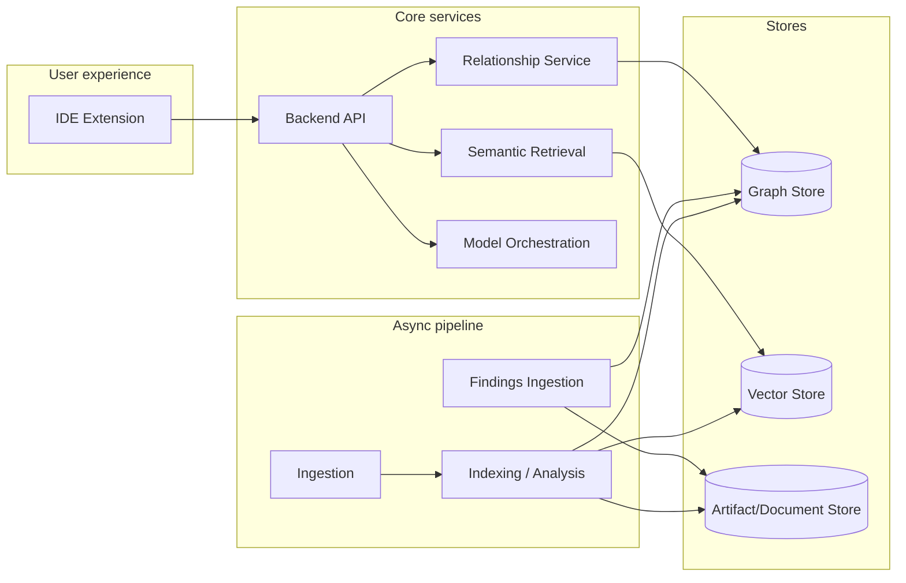

# CodeKnowl — Architecture & Design (Tactical / Functional Spec)

## 1. Purpose
This document is the tactical and functional specification for CodeKnowl. It translates the PRD into:

- Component responsibilities and boundaries
- External and internal interfaces
- Key data flows and system behaviors
- Logical data model and invariants
- Operational behaviors and acceptance expectations per milestone

This document intentionally avoids making new technical choices. Where a concrete technology decision is required, it references the ITD register by ID.

### 1.1 At a glance

| Concern | Design intent |
| --- | --- |
| Evidence model | Deterministic retrieval produces citations and relationship paths; LLM produces narrative |
| Primary UX | IDE extension calls backend APIs; citations must be clickable |
| Work separation | Indexing is async; Q&A/retrieval is latency-sensitive |
| Storage | Relationship store + semantic index + artifact/document storage |
| Compliance posture | On-prem, local-first, no required cloud runtime dependencies |

## 2. Scope

### 2.1 In scope
- Repository onboarding, ingestion, and indexing
- Repository off-boarding (repository lifecycle management)
- Structured relationship extraction and traversal-based retrieval (CPG pattern)
- Semantic retrieval (embeddings + vector search) and optional reranking
- Q&A experiences with citations through the IDE extension
- Incremental updates for new commits
- Administrative visibility for indexing status and failures
- Findings ingestion as optional enrichment (scanner outputs via SARIF/JSON)

### 2.2 Out of scope (MVP)
- Runtime scanning / running-code analysis (parking lot)
- Official Docker images and bundled scanner binaries in the open-source MVP distribution
- Full multi-tenant SaaS

## 3. Architectural principles
- **Traceability first**: every answer should be grounded in source citations and/or inspectable relationship paths.
- **Deterministic structure + probabilistic narrative**: deterministic retrieval produces evidence; LLMs produce explanations.
- **Separation of concerns**:
  - ingestion/indexing is asynchronous
  - retrieval and Q&A are latency-sensitive
- **Local-first / on-prem**: no required cloud dependency at runtime beyond Git remote access.
- **Technology decisions live in ITDs**: this doc references ITDs, it does not decide.

## 4. Key decisions (references)
- **Code representation**: Code Property Graph (CPG) (`ITD-01`)
- **Primary UX**: VS Code extension (`ITD-02`)
- **API framework**: (`ITD-03`)
- **AuthN/AuthZ**: (`ITD-04`)
- **Graph store**: (`ITD-05`)
- **Vector store**: (`ITD-06`)
- **Inference runtime + model roles**: (`ITD-07` and related model ITDs)

## 5. System context

### 5.1 Actors
- **Developer**: asks questions, navigates code relationships, runs impact analysis.
- **Operator**: configures repositories, credentials, monitors indexing health.
- **CI system (optional)**: runs scanners, produces SARIF/JSON artifacts for ingestion.

### 5.2 External systems
- **Git providers**: GitHub/GitLab/Bitbucket/Gitea/Generic Git.
- **Identity provider**: enterprise IdP via OIDC; optional directory sync (per ITD).
- **Model services**: on-prem model serving runtime (per ITD).

## 6. Component model

### 6.0 Component summary (table)

| Component | Primary responsibility | Latency profile |
| --- | --- | --- |
| IDE Extension | UI, commands, citation navigation | Interactive |
| Backend API | Auth, orchestration, query routing | Interactive |
| Ingestion | Clone/pull, repo snapshots | Async |
| Indexing pipeline | Parse/extract/chunk/embed/index | Async |
| Relationship service | Traversals / impact analysis | Interactive |
| Semantic retrieval | Vector search + rerank | Interactive |
| Findings ingestion (optional) | Ingest SARIF/JSON | Async |

### 6.1 IDE Extension
Responsibilities:
- Provide chat UI and commands.
- Send user questions and context to backend.
- Render citations as clickable links to file + line range.

Interfaces:
- Backend API: chat/question endpoint(s)
- Backend API: indexing status endpoints

Key behaviors:
- “Index repo/workspace” command triggers onboarding or indexing.
- Chat responses stream or return with structured citations.

### 6.2 API Gateway / Backend Service
Responsibilities:
- Serve IDE requests.
- Implement Q&A orchestration.
- Provide admin endpoints for repo management and status.
- Enforce auth and repo-level access control.

Interfaces:
- Public API to IDE extension
- Admin API (optional UI later)

Key behaviors:
- AuthN/AuthZ checks per request.
- Query routing to retrieval services.
- Task submission to job system for ingestion/indexing.

### 6.3 Ingestion Service
Responsibilities:
- Manage repository onboarding.
- Clone/pull repositories.
- Track last indexed commit per repo and branch.

Key behaviors:
- Validate credentials.
- Maintain local working copies or content-addressed snapshots.
- Emit “repo updated” events into job queue.

### 6.4 Indexing / Analysis Pipeline
Responsibilities:
- Parse source code.
- Extract symbols and relationships.
- Populate structured relationship store.
- Produce chunks and embeddings for semantic retrieval.
- Maintain incremental updates.

Key behaviors:
- Full indexing for initial repo.
- Incremental indexing for changed files/commits.
- Produce citations metadata (file, line ranges, symbol identity where possible).

### 6.5 Structured Relationship Service
Responsibilities:
- Provide traversal queries over the structured representation.
- Support impact analysis and relationship navigation.

Data:
- Nodes (entities): repo, file, symbol, type, function, class, module, package, commit snapshot
- Edges (relationships): contains, defines, references, calls, imports, inherits, depends_on

### 6.6 Semantic Retrieval Service
Responsibilities:
- Store and query embeddings.
- Support hybrid retrieval with deterministic relationship traversal.
- Optional reranking.

Data:
- chunk id, text, source metadata, embedding vector, timestamps

### 6.7 Model Orchestration
Responsibilities:
- Route requests to the appropriate model role:
  - general-purpose LLM
  - coding-specialized LLM
  - embeddings model
  - reranking model

Key behaviors:
- Stable contracts for chat/completions and embeddings.
- No required external network calls.

### 6.8 Findings Ingestion (Optional Enrichment)
Responsibilities:
- Ingest SARIF/JSON findings produced by external scanners.
- Normalize findings into CodeKnowl’s findings schema.
- Link findings to files/symbols where possible.

Non-goal:
- CodeKnowl does not bundle scanner binaries in MVP OSS distribution.

## 7. Data model (logical)

### 7.1 Core identifiers
- **RepoId**: stable identifier for a repository.
- **SnapshotId**: commit hash (and optionally branch).
- **ArtifactId**: stable ID for derived artifacts (chunks, embeddings, findings).

### 7.1.1 Repository identity (operator-facing)
CodeKnowl is repository-centric. A repository may be cloned into multiple workspaces/paths; CodeKnowl must avoid assuming a 1:1 mapping between a local checkout and a repository.

Identity fields:
- **RepoId** is the stable internal identity (a CodeKnowl-generated identifier).
- **CanonicalRemoteUrl** is the primary operator-facing identity when available.
- **LocalPathIdentity** is a fallback identity for local-only repositories with no remote configured.

Rules:
- Prefer identifying a repository by a canonicalized Git remote URL (e.g., `remote.origin.url`) when present.
- If no remote URL is configured, use the fully-qualified local filesystem path as the repository identity until a remote is added.
- Remote URLs are treated as an indicative identity, not a permanently reliable unique key:
  - remotes can change during migrations (e.g., Bitbucket to GitLab), rewrites, or operator policy changes.
  - CodeKnowl must not silently merge or rewrite repository identities based only on a remote URL change.
- Forks are treated as distinct repositories by default, even if they share history or identical content at some point in time.

Canonicalization and edge cases (implementation notes):
- URL normalization must be consistent (e.g., normalize `ssh://`, SCP-like `git@host:org/repo.git`, and HTTPS forms when feasible) but should not over-normalize in ways that cause false merges.
- Multiple remotes may exist; `origin` is a convention, not a guarantee. If multiple remotes exist, operator configuration may be required.
- Local path identity must resolve symlinks and be explicit about case-sensitivity differences across platforms.
- When a remote changes, CodeKnowl should:
  - surface the change in operator-visible status,
  - allow operators to update the canonical remote URL for the repo record, and
  - preserve audit history.

### 7.2 Minimum stored objects
- **Repository**: url, default branch, auth config reference, created_at.
- **Snapshot**: repo_id, commit_hash, parent(s), indexed_at, status.
- **File**: repo_id, path, language, blob hash.
- **Symbol**: repo_id, symbol_id, kind, name, file_path, range.
- **Relationship edge**: (from_id, to_id, type, evidence).
- **Chunk**: chunk_id, file_path, range, text, snapshot_id.
- **Embedding**: chunk_id, vector, model_id, snapshot_id.
- **Finding (optional)**: tool_id, rule_id, severity, location(s), snapshot_id, fingerprint.
- **Audit event**: actor, action, timestamp, object reference.

### 7.3 Invariants
- Every answer must include at least one citation for any code-derived claim.
- Every citation must map to an indexed snapshot and a concrete file + range.
- Repo boundaries are preserved by default; cross-repo retrieval requires explicit user scope.

## 8. Key workflows and sequences

### 8.1 Repository onboarding
1. Operator/developer provides repo URL and auth.
2. Backend validates and registers repo.
3. Ingestion clones/pulls default branch.
4. Indexing pipeline performs full index for snapshot.
5. Status becomes “indexed” with last indexed commit.

### 8.1.1 Repository off-boarding
1. Operator requests off-boarding for a repository.
2. Backend marks the repository as off-boarded (no longer queryable).
3. Backend prevents new queries from returning results for the off-boarded repo.
4. Backend documents and exposes whether artifacts are retained or deleted (implementation choice), and logs an audit event.
5. The system supports re-onboarding the repository later.

### 8.2 Ask a question with citations
1. IDE sends question + repo scope.
2. Backend authorizes access.
3. Retrieval plan executes:
   - semantic retrieval over chunks
   - relationship traversal retrieval (for symbols/paths)
   - optional reranking
4. Backend builds an evidence bundle with citations.
5. LLM generates an answer constrained to evidence.
6. IDE displays response with citations.

### 8.3 Relationship navigation (callers/callees/impact)
1. IDE requests relationship query for symbol.
2. Backend queries relationship service.
3. Response returns:
   - symbol metadata
   - relationship results
   - navigable locations

### 8.4 Incremental update
1. Ingestion detects new commit(s) on default branch.
2. Pipeline identifies changed files.
3. Recompute affected symbols/edges/chunks/embeddings.
4. Update snapshot index state.

### 8.5 Findings ingestion (optional)
1. CI uploads SARIF/JSON for a repo snapshot.
2. Backend validates schema and normalizes findings.
3. Findings are attached to snapshot and linked to file locations.

## 9. Interfaces (functional)

### 9.1 Repo management
- Register repo
- Trigger index
- Get repo status
- Off-board repo

### 9.2 Retrieval / Q&A
- Ask question (repo scoped)
- Explain file/module
- Relationship query (by symbol id)

### 9.3 Admin / Observability
- List indexing jobs and outcomes
- Health and basic metrics

### 9.4 Findings ingestion (optional)
- Upload findings artifact (SARIF/JSON)
- List findings by repo/snapshot

## 10. Non-functional requirements (mapped)
- **Security**: protect credentials; enforce repo access; audit.
- **Reliability**: retry/resume indexing; expose failure modes.
- **Performance**: incremental indexing faster than full index.
- **Scalability**: multi-repo; worker concurrency.

## 11. Milestone mapping (from PRD)

### Milestone 0
- Deliverables: PRD approval, conceptual diagram, buy-vs-build plan.
- Design focus: component boundaries and interface contracts.

### Milestone 1
- Deliverables: single repo indexed; evidence-grounded Q&A.
- Design focus: ingestion + indexing pipeline + evidence bundle generation.

### Milestone 2
- Deliverables: IDE chat, explain, relationship navigation.
- Design focus: stable API contracts and citation UX.

### Milestone 3
- Deliverables: incremental updates.
- Design focus: snapshot tracking, change detection, partial recompute.

### Milestone 4
- Deliverables: multi-repo + hardening.
- Design focus: scoping, RBAC, audit, observability.

## 12. Risks and mitigations
- **Language coverage and correctness**: start with MVP languages; be explicit about confidence and citations.
- **Index staleness**: prioritize incremental update correctness and operator visibility.
- **Answer hallucination**: enforce evidence bundle constraints and require citations.
- **Operational complexity**: avoid bundling scanners and avoid OSS Docker images in MVP.

## 13. Open questions
- MVP language priority ordering within: Java, Python, Rust, Go, JavaScript, TypeScript.
- Symbol identity strategy across incremental updates.
- How to represent ambiguous relationships or partial parsing.
- Findings schema normalization rules and fingerprinting strategy.
