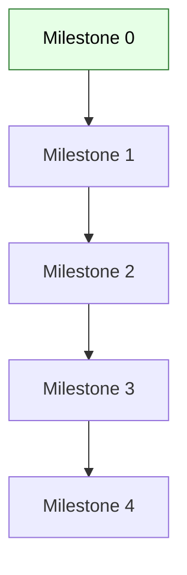
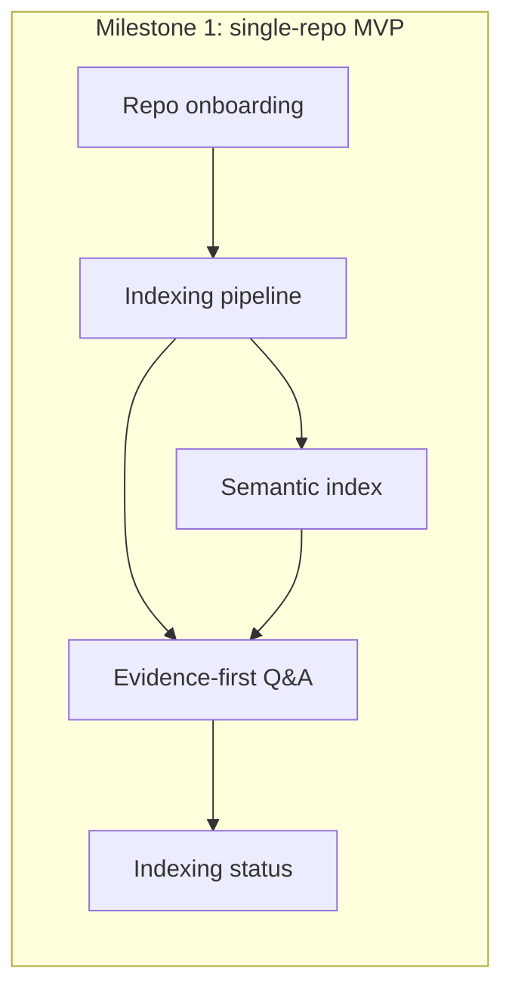
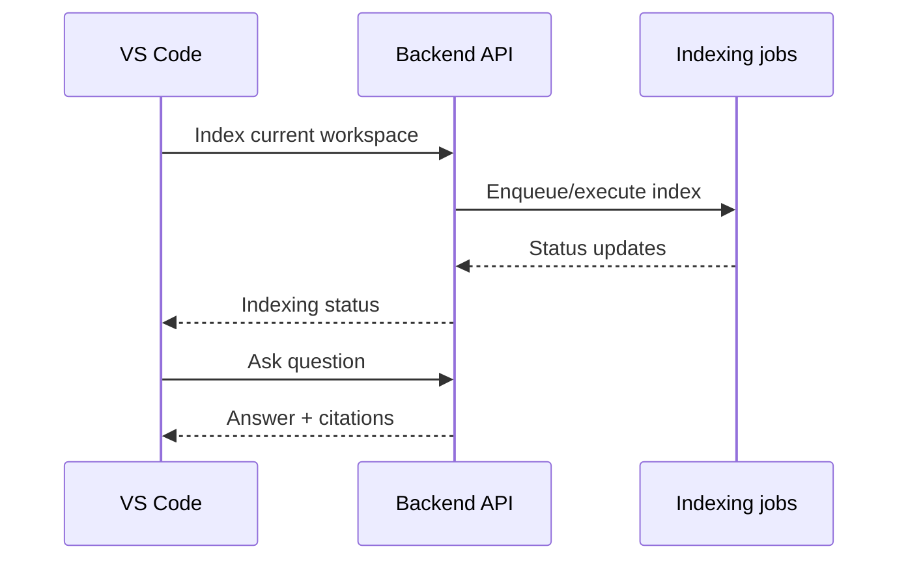

# CodeKnowl — Implementation Plan / Tracker

## 1. Purpose
This document is the core project planner for CodeKnowl implementation.

- It tracks delivery of milestones in the sequence defined by the PRD.
- It maps each milestone to a Definition of Done aligned to PRD acceptance criteria.
- It provides a tactical checklist of work items that can be updated as implementation proceeds.

This is not an ITD document. Technology decisions are tracked in the ITD register.

### 1.1 At a glance

| Item | Meaning |
| --- | --- |
| What this tracker is | The canonical milestone checklist aligned to the PRD |
| What this tracker is not | A technical decision record (see ITDs) |
| How to use it | Update statuses as code lands; link PRs/issues in Notes |

## 2. Tracker conventions

### 2.1 Status values
- Not started
- In progress
- Blocked
- Done

### 2.2 Fields
Each work item uses:
- Status
- Owner
- Target date
- Notes (links to PRs/issues/docs)

## 3. Milestones (authoritative)
Milestones 0–4 are sourced from `docs/prd-revised.md` and reflected in `docs/architecture-and-design.md`.

If milestone definitions drift, align the PRD first, then update this tracker.

| Source | Authority |
| --- | --- |
| `docs/prd-revised.md` | Product requirements and milestone acceptance criteria |
| `docs/architecture-and-design.md` | Tactical design mapped to milestones |
| This tracker | Execution checklist and status |

---

## Milestone 0 — PRD + architecture baseline

### Definition of Done (PRD acceptance criteria)
- The revised PRD is approved by product stakeholders.
- A high-level component diagram exists and is understandable by non-engineering stakeholders.
- The buy-vs-build evaluation plan clearly defines evaluation criteria, comparison scope, and decision owners.

### Work items
- [ ] Publish `docs/prd-revised.md` and record approval
  - Status: Done
  - Owner:
  - Target date:
  - Notes:
- [ ] Create Architecture & Design doc (`docs/architecture-and-design.md`)
  - Status: Done
  - Owner:
  - Target date:
  - Notes:
- [ ] Create a buy-vs-build evaluation plan artifact
  - Status: Not started
  - Owner:
  - Target date:
  - Notes:

---

## Milestone 1 — Single-repo indexing MVP

### Definition of Done (PRD acceptance criteria)
- Given a repository URL and credentials, the system can complete an initial indexing run and report completion.
- A user can ask at least:
  - “What does this file/module do?”
  - “Where is this function/symbol defined?”
  - “What calls this function?”
- Each answer includes citations to source locations (file path + line range).
- Index state is visible for the repo (last indexed commit and last successful run time).

### Workstreams and work items

| Workstream | Deliverable | PRD acceptance criteria supported |
| --- | --- | --- |
| A | Repo can be registered and cloned | Index run completes and reports completion |
| B | Minimum entities/relationships extracted | Define/locate symbols and basic call relationships |
| C | Chunks + embeddings stored/queryable | “Explain file/module” and semantic retrieval |
| D | Retrieve → evidence bundle → answer | Answers include citations (file + line range) |
| E | Status model + endpoint | Index state visible (commit + last successful run) |

#### A) Repository onboarding and ingestion
- [ ] Repo registration (URL + credentials) stored and retrievable
  - Status: Not started
  - Owner:
  - Target date:
  - Notes:
- [ ] Clone/pull implementation for single repo
  - Status: Not started
  - Owner:
  - Target date:
  - Notes:
- [ ] Snapshot tracking for indexed commit
  - Status: Not started
  - Owner:
  - Target date:
  - Notes:

#### B) Indexing pipeline (minimum structured representation)
- [ ] Define minimum entity/relationship set for MVP languages
  - Status: Not started
  - Owner:
  - Target date:
  - Notes:
- [ ] Extract file inventory + language classification
  - Status: Not started
  - Owner:
  - Target date:
  - Notes:
- [ ] Symbol extraction (definitions) at MVP baseline
  - Status: Not started
  - Owner:
  - Target date:
  - Notes:
- [ ] Reference extraction (basic “find occurrences”) at MVP baseline
  - Status: Not started
  - Owner:
  - Target date:
  - Notes:

#### C) Semantic index
- [ ] Chunking strategy for code/text with stable citations
  - Status: Not started
  - Owner:
  - Target date:
  - Notes:
- [ ] Embedding generation pipeline
  - Status: Not started
  - Owner:
  - Target date:
  - Notes:
- [ ] Vector index write/query integration
  - Status: Not started
  - Owner:
  - Target date:
  - Notes:

#### D) Evidence-first Q&A (internal API)
- [ ] Evidence bundle format (contexts + citations)
  - Status: Not started
  - Owner:
  - Target date:
  - Notes:
- [ ] Question answering orchestration (retrieve → assemble evidence → generate)
  - Status: Not started
  - Owner:
  - Target date:
  - Notes:
- [ ] Citation enforcement (answer must cite file + line ranges)
  - Status: Not started
  - Owner:
  - Target date:
  - Notes:

#### E) Indexing status
- [ ] Status model: queued/running/succeeded/failed
  - Status: Not started
  - Owner:
  - Target date:
  - Notes:
- [ ] Repo status endpoint/command (internal)
  - Status: Not started
  - Owner:
  - Target date:
  - Notes:

---

## Milestone 2 — IDE extension MVP

### Definition of Done (PRD acceptance criteria)
- From within the IDE, a user can:
  - index the current repo/workspace
  - ask a question and receive an answer with citations
  - request “explain file/module” and receive a summary with citations
  - navigate at least one relationship query (e.g., callers/callees/definitions) with clickable locations.
- The IDE experience clearly indicates indexing status and failure states.

### Workstreams and work items

#### A) VS Code extension shell
- [ ] Extension scaffolding and configuration
  - Status: Done
  - Owner:
  - Target date:
  - Notes: VS Code extension scaffold added under `vscode-extension/` (TypeScript, lint, build, tests).
- [ ] Chat UI with streaming/non-streaming rendering
  - Status: Not started
  - Owner:
  - Target date:
  - Notes:

#### B) IDE commands
- [ ] “Index current workspace/repo” command
  - Status: Not started
  - Owner:
  - Target date:
  - Notes:
- [ ] “Explain file/module” command
  - Status: Not started
  - Owner:
  - Target date:
  - Notes:
- [ ] “Relationship navigation” command
  - Status: Not started
  - Owner:
  - Target date:
  - Notes:

- [ ] “Ask question” command
  - Status: Done
  - Owner:
  - Target date:
  - Notes: Implemented `CodeKnowl: Ask` command calling backend `POST /qa/ask`.

#### C) Citations UX
- [ ] Render citations as clickable locations
  - Status: Not started
  - Owner:
  - Target date:
  - Notes:
- [ ] Show indexing status + failure states
  - Status: Not started
  - Owner:
  - Target date:
  - Notes:

---

## Milestone 3 — Incremental updates

### Definition of Done (PRD acceptance criteria)
- After a new commit is merged to the default branch, the system updates its indexes without requiring a full re-index.
- The system surfaces indexing failures and retry status in a user-visible way.
- A user can verify that answers reflect the latest indexed commit.

### Workstreams and work items

#### A) Change detection
- [ ] Detect new commits on default branch
  - Status: Not started
  - Owner:
  - Target date:
  - Notes:
- [ ] Determine changed files per new snapshot
  - Status: Not started
  - Owner:
  - Target date:
  - Notes:

#### B) Incremental recompute
- [ ] Partial re-index plan for changed files
  - Status: Not started
  - Owner:
  - Target date:
  - Notes:
- [ ] Update structured relationships incrementally
  - Status: Not started
  - Owner:
  - Target date:
  - Notes:
- [ ] Update semantic chunks/embeddings incrementally
  - Status: Not started
  - Owner:
  - Target date:
  - Notes:

#### C) User-visible status
- [ ] Status reporting includes retries and failure reasons
  - Status: Not started
  - Owner:
  - Target date:
  - Notes:

---

## Milestone 4 — Multi-repo support + hardening

### Definition of Done (PRD acceptance criteria)
- A user can add and index multiple repositories and scope queries to a selected repo.
- Access to repositories is enforced (users cannot query repos they are not authorized to access).
- Operators can observe:
  - indexing throughput and failures
  - system health status
- The system meets a defined reliability target for indexing jobs over a representative time window.

### Workstreams and work items

#### A) Multi-repo indexing
- [ ] Multiple repo registration and isolation
  - Status: Not started
  - Owner:
  - Target date:
  - Notes:
- [ ] Query scoping UX and backend enforcement
  - Status: Not started
  - Owner:
  - Target date:
  - Notes:

#### B) Access control alignment
- [ ] Repo-level RBAC enforcement
  - Status: Not started
  - Owner:
  - Target date:
  - Notes:
- [ ] Audit logging for key user actions
  - Status: Not started
  - Owner:
  - Target date:
  - Notes:

#### C) Observability and reliability
- [ ] Health endpoints
  - Status: Not started
  - Owner:
  - Target date:
  - Notes:
- [ ] Metrics: indexing throughput, failures, lag
  - Status: Not started
  - Owner:
  - Target date:
  - Notes:
- [ ] Reliability target defined and measured
  - Status: Not started
  - Owner:
  - Target date:
  - Notes:

---

## 4. Parking lot
These items are intentionally deferred until adopter demand exists or internal needs require them.

- Official Docker images for OSS distribution
- Bundled scanner binaries
- Runtime scanning / “running code” scanning beyond baseline DAST
- Expanded language coverage beyond MVP
