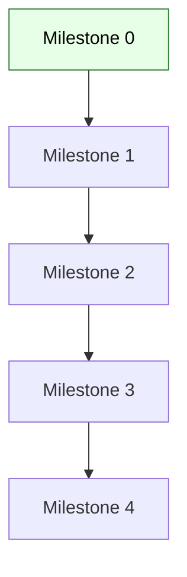
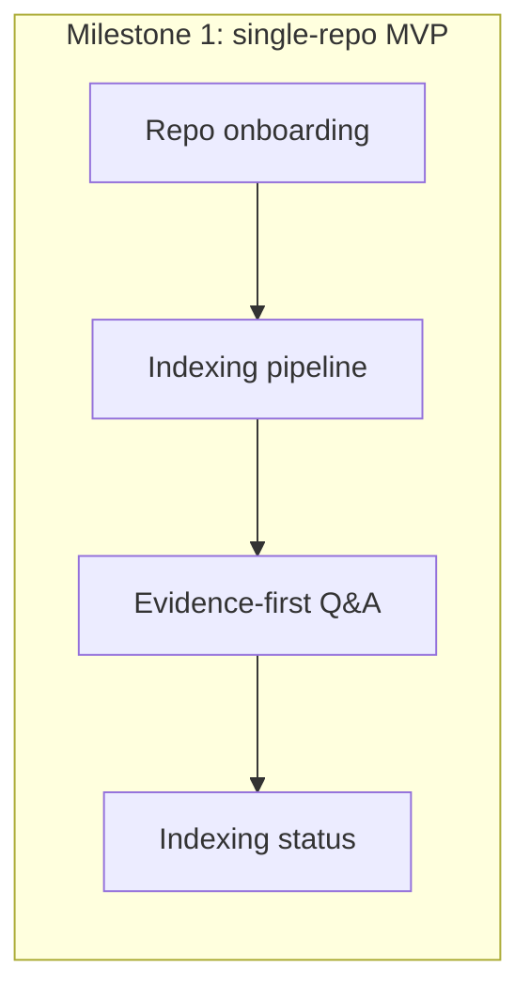
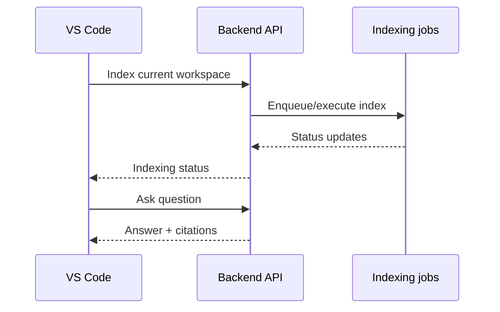

# CodeKnowl — Implementation Plan / Tracker

## 1. Purpose
This document is the core project planner for CodeKnowl implementation.

- It tracks delivery of milestones in the sequence defined by the PRD.
- It maps each milestone to a Definition of Done aligned to PRD acceptance criteria.
- It provides a tactical checklist of work items that can be updated as implementation proceeds.

This is not an ITD document. Technology decisions are tracked in the ITD register.

### 1.1 At a glance

| Item | Meaning |
| --- | --- |
| What this tracker is | The canonical milestone checklist aligned to the PRD |
| What this tracker is not | A technical decision record (see ITDs) |
| How to use it | Update statuses as code lands; link PRs/issues in Notes |

```mermaid
flowchart TB
  M0[Milestone 0] --> M1[Milestone 1]
  M1 --> M2[Milestone 2]
  M2 --> M3[Milestone 3]
  M3 --> M4[Milestone 4]
  M0:::done
  classDef done fill:#e6ffe6,stroke:#2f7d32,color:#000;
```

## 2. Tracker conventions

### 2.1 Status values
- Not started
- In progress
- Blocked
- Done

### 2.2 Change management (document evolution)
The PRD, Architecture & Design, and this tracker are expected to evolve as implementation uncovers new requirements, constraints, or better technical alternatives.

When a new feature, scope change, or technical alternative is discovered:

1. Update the core documents (PRD, Architecture & Design, and this tracker) to reflect the new understanding.
2. Review all milestones currently marked as Done and determine whether their deliverables or acceptance criteria need to be revisited based on the change.
3. If changes are required for any previously completed milestone, add the required work items and complete that backfill work before resuming work on the milestone that was in progress when the change was introduced.

### 2.3 Quality gates and “no broken pushes” rule
- Work items should be marked `Done` when they are completed (not only at milestone completion).
- Coding standards and Definition of Done must be satisfied before pushing changes to the remote.
- Stated another way: do not push to the remote unless the code works and meets `docs/CODING_STANDARDS_AND_DOD.md`.

### 2.4 Fields
Each work item uses:
- Status
- Owner
- Target date
- Notes (links to PRs/issues/docs)

## 3. Milestones (authoritative)
Milestones 0–4 are sourced from `docs/prd-revised.md` and reflected in `docs/architecture-and-design.md`.

If milestone definitions drift, align the PRD first, then update this tracker.

| Source | Authority |
| --- | --- |
| `docs/prd-revised.md` | Product requirements and milestone acceptance criteria |
| `docs/architecture-and-design.md` | Tactical design mapped to milestones |
| This tracker | Execution checklist and status |

---

## Milestone 0 — PRD + architecture baseline

Milestone status: Done

### Definition of Done (PRD acceptance criteria)
- The revised PRD is approved by product stakeholders.
- A high-level component diagram exists and is understandable by non-engineering stakeholders.
- The buy-vs-build evaluation plan clearly defines evaluation criteria, comparison scope, and decision owners.
- Coding standards and milestone DoD expectations are written down and applied consistently.
- CI runs the minimum quality gates for the MVP components (lint, typecheck, and tests/smoke where applicable).

### Work items
- [x] Publish `docs/prd-revised.md` and record approval
  - Status: Done
  - Owner:
  - Target date:
  - Notes: Approved 2026-02-27. Change-management caveat recorded: the PRD, Architecture & Design, and this tracker are expected to evolve; when changes are discovered we update the core docs, revisit completed milestones as needed, complete any backfill work for previously completed milestones, then resume the in-progress milestone.
- [x] Create Architecture & Design doc (`docs/architecture-and-design.md`)
  - Status: Done
  - Owner:
  - Target date:
  - Notes: Signed off 2026-02-27.
- [x] Document coding standards and Definition of Done (DoD)
  - Status: Done
  - Owner:
  - Target date:
  - Notes: See `docs/CODING_STANDARDS_AND_DOD.md`. Signed off 2026-02-27.
- [x] Scaffold CI quality gates for backend and IDE extension
  - Status: Done
  - Owner:
  - Target date:
  - Notes: GitHub Actions workflows added for backend smoke test and VS Code extension CI.
- [x] Create a buy-vs-build evaluation plan artifact
  - Status: Done
  - Owner:
  - Target date:
  - Notes: `docs/buy-vs-build-evaluation-plan.md`

---

## Milestone 1 — Single-repo indexing MVP

Milestone status: Done

### Definition of Done (PRD acceptance criteria)
- Given a local filesystem path to an already-cloned git repository, the system can complete an initial indexing run and report completion.
- A user can ask at least:
  - “What does this file/module do?”
  - “Where is this function/symbol defined?”
  - “What calls this function?”
- Each answer includes citations to source locations (file path + line range).
- Index state is visible for the repo (last indexed commit and last successful run time).
- An operator can off-board a repository so it is no longer queryable.

### Quality gates / DoD checks
- Coding standards and DoD satisfied (see `docs/CODING_STANDARDS_AND_DOD.md`).
- CI quality gates pass for relevant components (lint, typecheck, tests).
- Smoke/integration tests used for milestone validation are documented and runnable.

### Quality gate work items (authoritative)
- [ ] Backend smoke test script exists and is runnable (no-LLM path)
  - Status: Done
  - Owner:
  - Target date:
  - Notes: `backend/scripts/smoke_test.sh`
- [ ] GitHub Actions workflow runs backend smoke test on push/PR
  - Status: Done
  - Owner:
  - Target date:
  - Notes: `.github/workflows/backend-smoke-test.yml`

### Workstreams and work items

```mermaid
flowchart LR
  subgraph M1[Milestone 1: single-repo MVP]
    A[Repo onboarding]
    B[Indexing pipeline]
    D[Evidence-first Q&A]
    E[Indexing status]
  end
  A --> B
  B --> D
  D --> E
```

| Workstream | Deliverable | PRD acceptance criteria supported |
| --- | --- | --- |
| A | Repo can be registered (MVP: local path) | Index run completes and reports completion |
| B | Minimum entities/relationships extracted | Define/locate symbols and basic call relationships |
| D | Retrieve → evidence bundle → answer | Answers include citations (file + line range) |
| E | Status model + endpoint | Index state visible (commit + last successful run) |

#### A) Repository onboarding and ingestion
- [ ] Repo registration (local path; already-cloned) stored and retrievable
  - Status: Done
  - Owner:
  - Target date:
  - Notes: Backend service + CLI implement local-path repo registration (see `backend/src/codeknowl/service.py` and `backend/src/codeknowl/cli.py`).
- [ ] URL onboarding (clone/pull without CodeKnowl-managed credentials) deferred until Milestone 3+
  - Status: Not started
  - Owner:
  - Target date:
  - Notes: Decision note: CodeKnowl must not request or store Git credentials; any clone/pull would rely on operator-managed system Git authentication. For Milestones 0–2, onboarding is superseded by the IDE “discover-and-register” workflow.
- [ ] Snapshot tracking for indexed commit
  - Status: Done
  - Owner:
  - Target date:
  - Notes: Index runs record `head_commit`; exposed via `repo-status` and `GET /repos/{repo_id}/status`.

- [ ] Repo off-boarding (remove repo from query scope)
  - Status: Done
  - Owner:
  - Target date:
  - Notes: Implemented via CLI `repo-offboard` and API `DELETE /repos/{repo_id}`; deletes repo/index run rows and repo artifacts (see `backend/src/codeknowl/service.py`, `backend/src/codeknowl/cli.py`, `backend/src/codeknowl/app.py`). Covered by `backend/scripts/smoke_test.sh`.

#### B) Indexing pipeline (minimum structured representation)
- [ ] Define minimum entity/relationship set for MVP languages
  - Status: Done
  - Owner:
  - Target date:
  - Notes: Implemented minimal artifacts: file inventory + symbol definitions + best-effort call sites (see `backend/src/codeknowl/indexing.py`).
- [ ] Extract file inventory + language classification
  - Status: Done
  - Owner:
  - Target date:
  - Notes: `build_file_inventory()` writes `files.json` with `path`, `language`, `size_bytes`.
- [ ] Symbol extraction (definitions) at MVP baseline
  - Status: Done
  - Owner:
  - Target date:
  - Notes: `extract_symbols_and_calls()` writes `symbols.json` with per-symbol citation ranges.
- [ ] Reference extraction (basic “find occurrences”) at MVP baseline
  - Status: Done
  - Owner:
  - Target date:
  - Notes: Implemented as best-effort substring search returning citations via CLI `qa-find-occurrences` and API `GET /repos/{repo_id}/qa/find-occurrences` (see `backend/src/codeknowl/service.py`, `backend/src/codeknowl/cli.py`, `backend/src/codeknowl/app.py`). Covered by `backend/scripts/smoke_test.sh`.

#### C) Semantic index (deferred until Milestone 3)
- [ ] Chunking strategy for code/text with stable citations
  - Status: Not started
  - Owner:
  - Target date:
  - Notes:
- [ ] Embedding generation pipeline
  - Status: Not started
  - Owner:
  - Target date:
  - Notes:
- [ ] Vector index write/query integration
  - Status: Not started
  - Owner:
  - Target date:
  - Notes:

#### D) Evidence-first Q&A (internal API)
- [ ] Evidence bundle format (contexts + citations)
  - Status: Done
  - Owner:
  - Target date:
  - Notes: `qa-ask` returns `answer`, `citations`, and `evidence` derived from snapshot artifacts (see `backend/src/codeknowl/service.py`).
- [ ] Question answering orchestration (retrieve → assemble evidence → generate)
  - Status: Done
  - Owner:
  - Target date:
  - Notes: Implemented deterministic artifact-backed queries plus optional LLM-backed `qa-ask`.
- [ ] Multi-model QA synthesis pipeline (responders → synthesizer)
  - Status: Done
  - Owner:
  - Target date:
  - Notes: Implemented via `backend/src/codeknowl/llm.py` (`LlmProfiles`), `backend/src/codeknowl/ask.py` (`answer_with_llm_synthesis` + deterministic evidence caps), and wired in `backend/src/codeknowl/service.py` (`qa_ask_llm`). Covered by `backend/tests/test_qa_synthesis.py`.
- [ ] Citation enforcement (answer must cite file + line ranges)
  - Status: Done
  - Owner:
  - Target date:
  - Notes: Artifact-backed query endpoints return citations; LLM-backed answers are returned with citations/evidence bundle.

#### E) Indexing status
- [ ] Status model: queued/running/succeeded/failed
  - Status: Done
  - Owner:
  - Target date:
  - Notes: Stored in `index_runs.status` and exposed via CLI/API.
- [ ] Repo status endpoint/command (internal)
  - Status: Done
  - Owner:
  - Target date:
  - Notes: CLI `repo-status` and API `GET /repos/{repo_id}/status` return latest run and head commit.

---

## Milestone 2 — IDE extension MVP

Milestone status: Done

### Definition of Done (PRD acceptance criteria)
- From within the IDE, a user can:
  - index the current repo/workspace (MVP: register local filesystem path for an already-cloned repo, then trigger indexing)
  - ask a question and receive an answer with citations
  - request “explain file/module” and receive a summary with citations
  - navigate at least one relationship query (e.g., callers/callees/definitions) with clickable locations.
- The IDE experience clearly indicates indexing status and failure states.

### Quality gates / DoD checks
- Coding standards and DoD satisfied (see `docs/CODING_STANDARDS_AND_DOD.md`).
- VS Code extension passes linting, typechecking, and tests in CI.
- Backend endpoints used by the extension are covered by smoke/integration tests.

### Quality gate work items (authoritative)
- [ ] GitHub Actions workflow runs VS Code extension lint/typecheck/tests on push/PR
  - Status: Done
  - Owner:
  - Target date:
  - Notes: `.github/workflows/vscode-extension-ci.yml`

### Integration test work items (authoritative)
- [ ] Smoke/integration tests cover the backend HTTP endpoints used by the VS Code extension
  - Status: Done
  - Owner:
  - Target date:
  - Notes: `backend/scripts/http_smoke_test.sh` starts Uvicorn and exercises the extension-used endpoints (`/health`, `/repos`, `/repos/{repo_id}/index`, `/repos/{repo_id}/status`, `/repos/{repo_id}/qa/*`).

### Milestone validation (manual runbook)
- [ ] Document an end-to-end IDE MVP validation runbook (backend up + index + ask + citation navigation)
  - Status: Done
  - Owner:
  - Target date:
  - Notes: `docs/runbooks/milestone-2-ide-mvp-validation.md`

### Workstreams and work items

```mermaid
sequenceDiagram
  participant IDE as VS Code
  participant API as Backend API
  participant IDX as Indexing jobs
  IDE->>API: Index current workspace
  API->>IDX: Enqueue/execute index
  IDX-->>API: Status updates
  API-->>IDE: Indexing status
  IDE->>API: Ask question
  API-->>IDE: Answer + citations
```

#### A) VS Code extension shell
- [ ] Extension scaffolding and configuration
  - Status: Done
  - Owner:
  - Target date:
  - Notes: VS Code extension scaffold added under `vscode-extension/` (TypeScript, lint, build, tests).
- [ ] Chat UI with streaming/non-streaming rendering
  - Status: Done
  - Owner:
  - Target date:
  - Notes: MVP implemented as command-driven chat via `CodeKnowl: Ask` writing to the CodeKnowl output channel.

#### B) IDE commands
- [ ] “Index current workspace/repo” command
  - Status: Done
  - Owner:
  - Target date:
  - Notes: Implemented in `vscode-extension/src/extension.ts` using `POST /repos` + `POST /repos/{repo_id}/index` + `GET /repos/{repo_id}/status`.
- [ ] Discover-and-register onboarding flow (derive repo metadata from git + confirm)
  - Status: Done
  - Owner:
  - Target date:
  - Notes: Implemented in `vscode-extension/src/extension.ts` (git CLI discovery + confirm/edit UI + backend register) to reduce manual errors and ensure consistent `repo_id` identity across workspaces.
- [ ] “Explain file/module” command
  - Status: Done
  - Owner:
  - Target date:
  - Notes: Implemented as `CodeKnowl: Explain Current File` calling `GET /repos/{repo_id}/qa/explain-file`.
- [ ] “Relationship navigation” command
  - Status: Done
  - Owner:
  - Target date:
  - Notes: Implemented as `CodeKnowl: Where Is Symbol Defined?` (`GET /repos/{repo_id}/qa/where-defined`) and `CodeKnowl: What Calls Symbol?` (`GET /repos/{repo_id}/qa/what-calls`).

- [ ] “Ask question” command
  - Status: Done
  - Owner:
  - Target date:
  - Notes: Implemented in `vscode-extension/src/extension.ts` calling repo-scoped `POST /repos/{repo_id}/qa/ask`.

#### B.1) Repo scope / identity in the IDE (required for all repo-scoped calls)
- [ ] Decide and implement how the extension selects a `repo_id` (single default repo vs explicit picker)
  - Status: Done
  - Owner:
  - Target date:
  - Notes: Implemented as “primary workspace folder” repo identity; extension resolves `repo_id` by matching `local_path` from `GET /repos` or registering via `POST /repos`.
- [ ] Store and reuse the selected `repo_id` across commands
  - Status: Done
  - Owner:
  - Target date:
  - Notes: Persisted in VS Code workspace state keyed by workspace path.

#### B.2) Backend endpoint wiring (IDE integration)
- [ ] Update extension to call repo-scoped backend endpoints (e.g., `POST /repos/{repo_id}/qa/ask`)
  - Status: Done
  - Owner:
  - Target date:
  - Notes: Updated in `vscode-extension/src/extension.ts`.
- [ ] Implement "index current workspace" flow over HTTP (register local path then trigger index)
  - Status: Done
  - Owner:
  - Target date:
  - Notes: Backend provides `POST /repos { local_path }` and `POST /repos/{repo_id}/index`.

#### C) Citations UX
- [ ] Render citations as clickable locations
  - Status: Done
  - Owner:
  - Target date:
  - Notes: Implemented with a citations picker that opens files at cited lines (see `vscode-extension/src/extension.ts`).
- [ ] Show indexing status + failure states
  - Status: Done
  - Owner:
  - Target date:
  - Notes: Index command prints status/errors to the CodeKnowl output channel and shows user-facing error messages.

---

## Milestone 3 — Incremental updates

Milestone status: Done

### Definition of Done (PRD acceptance criteria)
- After a new commit is merged to the default branch, the system updates its indexes without requiring a full re-index.
- The system surfaces indexing failures and retry status in a user-visible way.
- A user can verify that answers reflect the latest indexed commit.

### Quality gates / DoD checks
- Coding standards and DoD satisfied (see `docs/CODING_STANDARDS_AND_DOD.md`).
- CI gates pass; incremental indexing behavior is validated with representative tests.

### Workstreams and work items

#### 1) Semantic index (deferred from Milestone 1)
- [ ] Chunking strategy for code/text with stable citations
  - Status: Done
  - Owner:
  - Target date:
  - Notes: Implemented in `backend/src/codeknowl/chunking.py` and persisted per-snapshot as `chunks.json`.
- [ ] Embedding generation pipeline
  - Status: Done
  - Owner:
  - Target date:
  - Notes: Implemented via `backend/src/codeknowl/embeddings.py` (OpenAI-compatible HTTP embeddings or hash fallback).
- [ ] Vector index write/query integration
  - Status: Done
  - Owner:
  - Target date:
  - Notes: Implemented via `backend/src/codeknowl/vector_store.py` (Qdrant primary; file fallback) and wired in `backend/src/codeknowl/service.py`.
 - [ ] Semantic retrieval wired into QA answering with citations
   - Status: Done
   - Owner:
   - Target date:
   - Notes: `qa-ask` calls vector search and includes semantic hits as evidence + citations.

#### A) Change detection
- [ ] Detect new commits on default branch
  - Status: Done
  - Owner:
  - Target date:
  - Notes: Accepted-code-first head detection via `CodeKnowlService._resolve_accepted_head_commit` (remote preferred via `preferred_remote`, local fallback to `refs/heads/{accepted_branch}`).
- [ ] Determine changed files per new snapshot
  - Status: Done
  - Owner:
  - Target date:
  - Notes: Changed/deleted file detection via `codeknowl.repo.diff_name_status(old_commit, new_commit)`.

#### B) Incremental recompute
- [ ] Partial re-index plan for changed files
  - Status: Done
  - Owner:
  - Target date:
  - Notes: Incremental patching implemented in `CodeKnowlService.update_repo_to_accepted_head_sync` using per-path extraction helpers (`build_file_records_for_paths`, `extract_symbols_and_calls_for_paths`). Writes new snapshot dir for new accepted-head commit.
- [ ] Update structured relationships incrementally
  - Status: Done
  - Owner:
  - Target date:
  - Notes: Structured artifacts (`symbols.json`, `calls.json`) are patched by removing entries for changed/deleted files and re-extracting only changed files.
- [ ] Update semantic chunks/embeddings incrementally
  - Status: Done
  - Owner:
  - Target date:
  - Notes: On update, embeddings are recomputed only for changed/added files and removed for deleted files; unchanged files retain existing vectors.

#### C) User-visible status
- [ ] Status reporting includes retries and failure reasons
  - Status: Done
  - Owner:
  - Target date:
  - Notes: Update/index endpoints return run record with `status` and `error`. Polling loop runs best-effort and failures are recorded in index_runs.

### Milestone validation (manual runbook)
- [ ] Document an end-to-end incremental update validation runbook (manual update + polling)
  - Status: Done
  - Owner:
  - Target date:
  - Notes: `docs/runbooks/milestone-3-incremental-updates-validation.md`

---

## Milestone 4 — Multi-repo support + hardening

Milestone status: Done

### Definition of Done (PRD acceptance criteria)
- A user can add and index multiple repositories and scope queries to a selected repo.
- Access to repositories is enforced (users cannot query repos they are not authorized to access).
- Operators can observe:
  - indexing throughput and failures
  - system health status
- The system meets a defined reliability target for indexing jobs over a representative time window.

### Quality gates / DoD checks
- Coding standards and DoD satisfied (see `docs/CODING_STANDARDS_AND_DOD.md`).
- CI gates pass across components.
- Security and access control behaviors are validated (tests + documented operator guidance).

### Workstreams and work items

#### A) Multi-repo indexing
- [ ] Multiple repo registration and isolation
  - Status: Done
  - Owner:
  - Target date:
  - Notes: Backend supports multiple repo registrations via `/repos` and stores artifacts under `.codeknowl/artifacts/{repo_id}/...`.
- [ ] Query scoping UX and backend enforcement
  - Status: Done
  - Owner:
  - Target date:
  - Notes: VS Code extension supports selecting an active repo per workspace via `codeknowl.selectRepo` (stored in workspaceState). Backend endpoints are repo-scoped under `/repos/{repo_id}/...`.

#### B) Access control alignment
- [ ] Repo-level RBAC enforcement
  - Status: Done
  - Owner:
  - Target date:
  - Notes: Repo-scoped endpoints enforce read/write access via `_require_repo_access` in `backend/src/codeknowl/app.py` using group-based policy from `backend/src/codeknowl/auth.py`. Covered by HTTP integration test `backend/tests/test_http_authz.py`.
- [ ] MVP shared-secret API key enforcement
  - Status: Done
  - Owner:
  - Target date:
  - Notes: Optional backend middleware controlled by `CODEKNOWL_API_KEY`; clients send `X-CodeKnowl-Api-Key`. `/health` remains unauthenticated.
- [ ] Authentication/authorization integration aligned with architecture decisions
  - Status: Done
  - Owner:
  - Target date:
  - Notes: OIDC/Keycloak mode implemented via `CODEKNOWL_AUTH_MODE=oidc` and `CODEKNOWL_OIDC_ISSUER_URL` with bearer token verification in `backend/src/codeknowl/app.py` + `backend/src/codeknowl/auth.py`. Repo authorization is enforced on repo-scoped endpoints; see `backend/tests/test_http_authz.py`.
- [ ] Audit logging for key user actions
  - Status: Done
  - Owner:
  - Target date:
  - Notes: Structured JSON audit events implemented in `backend/src/codeknowl/audit.py` and emitted by key HTTP endpoints (repo register/index/update/delete and QA ask) in `backend/src/codeknowl/app.py`. Query text is excluded by default and referenced by hash.

#### C) Observability and reliability
- [ ] Health endpoints
  - Status: Done
  - Owner:
  - Target date:
  - Notes: `/health` returns JSON with `status` and `details` including `repo_count`, `auth_enabled`, and `poll_interval_seconds`.
- [ ] Metrics: indexing throughput, failures, lag
  - Status: Done
  - Owner:
  - Target date:
  - Notes: `/metrics` returns JSON counters (in-memory) for index/update HTTP endpoints and poller update attempts/success/failure.
- [ ] Poller single-flight + backoff
  - Status: Done
  - Owner:
  - Target date:
  - Notes: Poller uses per-repo exponential backoff on failures and avoids overlapping work via `CodeKnowlService.update_repo_to_accepted_head_sync(..., blocking=False)`; manual updates block and poller skips when lock is held.
- [ ] Reliability target defined and measured
  - Status: Done
  - Owner:
  - Target date:
  - Notes: Initial SLO defined as: 99%+ success rate for `POST /repos/{repo_id}/update` and `POST /repos/{repo_id}/index` over a rolling operator-observed window (start with manual observation during Milestone 4). Measurement is available via `/metrics` derived fields `http.repos.update.success_rate` and `http.repos.index.success_rate`.

---

## Milestone 5 — Durable job queue + workers

Milestone status: Done

### Definition of Done (PRD acceptance criteria)
- Indexing and update operations run asynchronously via a worker queue and are retryable.
- Job status and failure reasons are visible to operators.

### Work items
- [x] ITD-14 Job queue + workers (Arq)
  - Status: Done
  - Owner:
  - Target date:
  - Notes: Move indexing/update workloads to async jobs with retries and durable state; keep sync endpoints as thin job enqueuers.

---

## Milestone 6 — Observability stack alignment

Milestone status: Done

### Definition of Done (PRD acceptance criteria)
- Metrics and logs are exportable/consumable by Loki + Prometheus/Grafana.
- Operator runbook documents how to observe indexing throughput, failures, and job lag.

### Work items
- [x] ITD-18 Observability stack alignment (Loki + Prometheus/Grafana)
  - Status: Done
  - Owner:
  - Target date:
  - Notes: Align logs/metrics export to Prometheus scrape format and add operator dashboard guidance.

---

## Milestone 7 — Graph relationship store (NebulaGraph)

Milestone status: Done

### Definition of Done (PRD acceptance criteria)
- Structured entities/edges are persisted in the graph store and queryable for relationship navigation.

### Work items
- [x] ITD-05 NebulaGraph integration (graph storage + queries)
  - Status: Done
  - Owner:
  - Target date:
  - Notes: ITD-05 is marked Completed (tech choice) but the backend currently uses JSON artifacts for structured relationships. Add NebulaGraph schema, ingestion, and query layer.

---

## Milestone 8 — Findings ingestion (scanner integrations)

Milestone status: Done

### Definition of Done (PRD acceptance criteria)
- Findings can be ingested and queried by repo/snapshot with traceable file/location links.

### Work items
- [x] ITD-19 Scanner integrations (SonarQube + Semgrep)
  - Status: Done
  - Owner:
  - Target date:
  - Notes: Add ingestion pipeline for findings (SARIF/JSON) and storage/query semantics.

---

## Milestone 9 — Admin UI + non-engineer access

Milestone status: Done

### Definition of Done (PRD acceptance criteria)
- Operators can manage repo lifecycle and view indexing status via a web UI.
- Non-engineers can access Q&A with citations via a web UI (within authorized scope).

### Work items
- [x] ITD-21 Admin UI surface (React)
  - Status: Done
  - Owner:
  - Target date:
  - Notes: Admin/ops UI for repo onboarding, indexing status, and health.

---

## Milestone 10 — URL onboarding (no credential storage)

Milestone status: Not started

### Definition of Done (PRD acceptance criteria)
- Repos can be registered by URL and (if/when clone/pull is implemented) Git authentication relies on operator-managed system Git configuration.

### Work items
- [ ] URL onboarding by clone URL (no CodeKnowl-managed credentials)
  - Status: Not started
  - Owner:
  - Target date:
  - Notes: Decision note: CodeKnowl must not request or store Git credentials; onboarding uses operator-managed system Git authentication.

---

## Milestone 11 — Optional agentic workflows (guardrailed)

Milestone status: Not started

### Definition of Done (PRD acceptance criteria)
- Proposed code changes are shown as diffs/previews and require explicit approval before writing.
- Any command execution requires explicit approval and captured output.

### Work items
- [ ] Guardrailed agentic workflow surface
  - Status: Not started
  - Owner:
  - Target date:
  - Notes: Implement multi-step tasks (search, plan, propose changes) with explicit approval gates.

---

## 4. Parking lot
These items are intentionally deferred until adopter demand exists or internal needs require them.

- Official Docker images for OSS distribution
- Bundled scanner binaries
- Runtime scanning / “running code” scanning beyond baseline DAST
- Expanded language coverage beyond MVP
