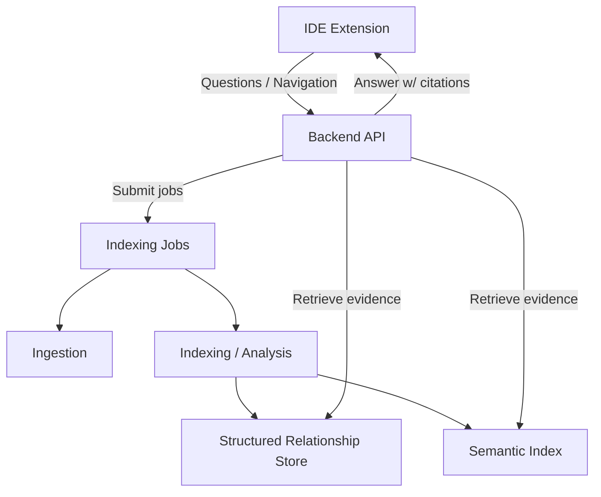
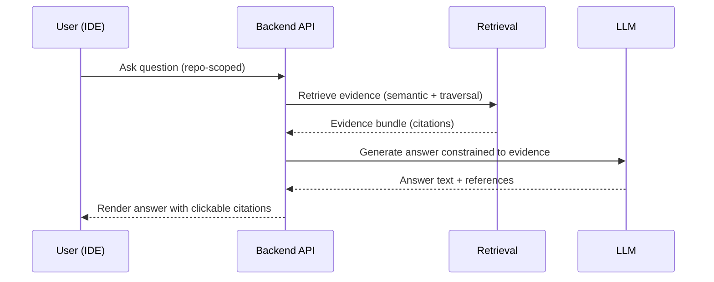
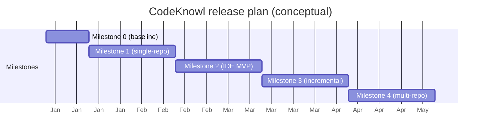

# CodeKnowl: Product Requirements Document (PRD) — Revised (No ITDs)

## 1. Overview

CodeKnowl is an on-prem, local-first “codebase analyst” product. Given one or more Git repositories, CodeKnowl ingests source code and maintains:

- A **structural relationship store** for code entities and relationships (e.g., files, symbols, call relationships, dependencies).
- A **knowledge base** suitable for retrieval, summarization, and analyst workflows.

CodeKnowl exposes an AI Software Analyst experience to end users primarily through an IDE extension, with optional CI-oriented workflows, designed to operate without required cloud dependencies (beyond access to Git hosts).

### 1.1 At a glance

| Area | Summary |
| --- | --- |
| Primary user experience | IDE-first (initially VS Code) Q&A with citations and navigation |
| Primary outputs | Evidence-grounded answers, navigable relationships, and indexed snapshots |
| Core stores | Structured relationship store + semantic index |
| Operating posture | On-prem, local-first; no required cloud runtime dependencies |
| OSS posture | MIT-licensed project with permissive, redistribution-safe dependencies |

## 2. Problem Statement

Teams need fast, trustworthy answers about their codebases:

- What does this module do?
- Where is a given behavior implemented?
- What are the dependencies / call chains / data flows?
- What will likely break if I change this function?
- How do I onboard a new engineer quickly?

Cloud-based code assistants are often not viable due to:

- Compliance / data residency requirements
- IP protection concerns
- Latency, cost, and reliability constraints

## 3. Goals and Non-Goals

### 3.1 Goals

- Ingest one or more Git repositories and build a persistent, queryable representation of the codebase.
- Maintain an up-to-date relationship store and knowledge base as new commits land on the default branch.
- Provide interactive “code analyst” experiences inside the IDE.
- Support multiple Git hosting providers.
- Favor local-first operation, with no required runtime cloud dependency other than reaching Git remotes.
- Be viable as an MIT-licensed open-source project, including a recommended on-prem deployment and sizing story.

### 3.2 Non-Goals (initial releases)

- Building a fully managed SaaS offering.
- Building a general-purpose “chat with your company” product beyond code analysis.
- Perfect language coverage for all languages on day one.
- Guaranteeing complete correctness of all AI responses (focus is on traceability and citations rather than perfection).

## 4. Target Users

- **Software engineers** working in medium-to-large codebases.
- **Tech leads / architects** performing dependency analysis and refactoring planning.
- **Security and compliance teams** requiring on-prem operation.
- **SRE / platform engineers** who maintain developer tooling and internal platforms.

## 5. User Experience (UX) and Primary Workflows

### 5.1 IDE extension (primary interface)

Core workflows:

- **Ask questions with citations**
  - Natural language queries about code.
  - Responses include links/locations back to source and/or relationship paths.

- **Navigate code relationships**
  - Jump from symbol to dependents/callers/callees.
  - View high-level module summaries.

- **Impact analysis**
  - “If I change X, what might break?”
  - Uses relationship traversal + indexed references.

- **(Optional) Agentic coding workflows (guardrailed)**
  - Multi-step tasks (search, plan, propose changes) executed locally.
  - Strong controls: require confirmation before changes.

### 5.2 Repository onboarding workflow

- Add one or more Git repo URLs.
- Choose branches to index (initially: default/main branch).
- Run initial ingestion and indexing.
- Verify indexing status and health.

### 5.3 Repository off-boarding workflow

- Remove a repository from CodeKnowl so it is no longer queryable.
- Off-boarding must be explicit and operator-driven (no automatic removal).
- The system must support re-adding the repository later.
- Off-boarding must support migration scenarios (e.g., Bitbucket to GitLab, monorepo split into smaller repos) where operators replace repositories over time.

### 5.4 Continuous update workflow

- Detect new commits merged into the default branch.
- Incrementally update:
  - the relationship store
  - the knowledge base (including semantic indexes)
- Provide status and alerting when indexing fails.

## 6. Functional Requirements

### 6.1 Repository ingestion

- Support adding multiple repos.
- Support Git providers (initial):
  - GitHub
  - GitLab
  - Bitbucket
  - Gitea
  - “Generic Git” via clone URL
- Support multiple auth methods for Git access (initial):
  - personal access tokens
  - SSH keys
- Support air-gapped / offline operation except for Git access.

#### 6.1.1 Repository off-boarding

- Support removing a repository from the index so it is no longer queryable.
- Off-boarding must have a clear scope and behavior:
  - remove from active query scope and listing
  - prevent future queries from returning results for the off-boarded repo
  - define whether stored artifacts are deleted or retained (implementation-specific), but the behavior must be documented and operator-visible
- Support re-onboarding a previously off-boarded repository.

### 6.2 Indexing and analysis

- Build and maintain a **structured representation of code** suitable for deterministic relationship queries (e.g., symbols, containment, calls/imports/references where feasible).
- Maintain a **knowledge base** suitable for retrieval-augmented generation (RAG).
- Support incremental updates on new commits.

#### 6.2.1 Minimum bar

- Support hybrid retrieval:
  - semantic retrieval over code/text
  - relationship traversal retrieval over the structured representation
- Support hybrid search experiences (not only semantic search):
  - deterministic symbol navigation (definitions/references) where feasible
  - regex/text search for “find all occurrences” workflows
- Provide first-class citations in all answers:
  - file path
  - line ranges
  - symbol identity (where applicable)
- Support an incremental re-index strategy:
  - detect changed files and update derived indexes without full re-ingest
- Support per-repo isolation in storage and indexing (avoid cross-contamination between repos by default).

#### 6.2.2 Competitor parity requirements

- Multi-repo indexing and navigation:
  - support indexing and querying across multiple repositories
  - preserve repo-level boundaries and allow users to scope queries to a repo
- Access control alignment (enterprise expectations):
  - repository-level access control
  - audit logging for security and compliance review
- Report-oriented outputs:
  - generate standard “codebase understanding” reports (summary, dependency highlights, risk areas)
  - results must be reproducible and traceable (citations + stored query inputs)

### 6.3 Data storage and retrieval services (capabilities)

CodeKnowl must provide the following storage capabilities (implementation choices are captured in the ITD register):

- A **relationship store** for structured queries and traversals across code entities.
- A **semantic index** for vector-based retrieval.
- A **document store** (or equivalent capability) for persisted artifacts such as:
  - indexing metadata
  - extracted facts
  - prompts/queries (for reproducibility)
  - audit events

### 6.4 Local models / inference (capabilities)

CodeKnowl must support fully on-prem inference for the following model roles:

- A **general-purpose LLM**
  - Used for summarization, explanation, and non-coding analyst tasks.
- A **coding-specialized LLM**
  - Used for code-aware Q&A, impact analysis narratives, and optional agentic coding workflows.
- An **embeddings model**
  - Used to embed code and related text for semantic retrieval.
- A **reranking model**
  - Used to improve retrieval precision/ordering for top candidate contexts.

Requirements:

- All model roles must be runnable without required external network calls.
- The system must allow **model routing** by task type (coding vs general vs embedding vs rerank).
- The system must support swapping models over time without breaking external APIs (stable contracts for:
  - chat completion
  - embeddings
  - reranking)

### 6.5 IDE extension requirements

- Provide a chat-style interface.
- Provide commands for:
  - “Index current workspace/repo”
  - “Search symbol / relationship”
  - “Explain file/module”
  - “Impact analysis”
- Provide citations (file paths + line ranges) for answers.

#### 6.5.1 Optional agentic change workflow (guardrailed)

- When proposing code changes, CodeKnowl must:
  - present a diff/preview
  - require explicit user approval before writing to disk
- When running commands (tests/linters/builds), CodeKnowl must:
  - require explicit user approval before execution
  - capture command output as part of the task trace

### 6.6 Administration / observability

- Show indexing state per repository:
  - last indexed commit
  - last successful run time
  - errors and retries
- Provide operator controls for repository lifecycle:
  - onboard/register
  - trigger indexing
  - off-board/remove
- Provide basic health endpoints and metrics.
- Provide an operator-friendly deployment and sizing story:
  - document instance sizing guidance for common deployment sizes
  - provide resource estimates for indexing workloads

## 7. Quality Attributes (Non-Functional Requirements)

- **On-prem first**: no required cloud dependency beyond Git remote access.
- **Performance**: incremental updates should be faster than full re-index.
- **Scalability**: support multiple repos; ability to scale ingestion/indexing workers.
- **Reliability**: resilient to indexing failures; retry and resume.
- **Security**:
  - secure storage of Git credentials
  - least-privilege principles
  - local network-only by default
- **Traceability**: answers should cite sources; relationship queries should be inspectable.

## 7.1 Assumptions and Constraints

- CodeKnowl must have a credible recommended deployment configuration that balances cost and performance for on-prem buyers.
- The system must operate without required cloud dependencies beyond access to Git repositories.
- The project should remain viable as an MIT-licensed open-source solution.

## 8. Architecture (Conceptual)

### 8.1 Core components (capabilities)

- **Ingestion service**
  - clones/pulls repos
  - detects updates

- **Analysis/indexing pipeline**
  - parsing, symbol extraction
  - relationship extraction
  - chunking + embedding
  - indexing + incremental updates

- **Structured relationship service**
  - supports traversal queries for impact analysis and navigation

- **Semantic retrieval service**
  - vector search + optional reranking

- **Model services**
  - general LLM
  - coding LLM
  - embeddings
  - reranker

- **Developer interface**
  - IDE extension
  - optional admin UI

## 9. Buy vs Build Evaluation

CodeKnowl should include a structured buy-vs-build assessment early.

Evaluation criteria:

- On-prem support and licensing
- Extensibility (structured relationships + RAG + IDE integration)
- Total cost (license + hardware)
- Data residency/compliance
- Ability to integrate local models and local stores

Deliverable:

- A short comparison document and a recommendation (continue building vs adopt/extend an existing tool).

## 10. Release Plan (Milestones)

### Milestone 0: PRD + architecture baseline

- revised PRD approved
- initial architecture diagram + component boundaries
- buy-vs-build evaluation plan created

Acceptance criteria:
- The revised PRD is approved by product stakeholders.
- A high-level component diagram exists and is understandable by non-engineering stakeholders.
- The buy-vs-build evaluation plan clearly defines evaluation criteria, comparison scope, and decision owners.

### Milestone 1: Single-repo indexing MVP

- ingest one repo
- generate basic structured representation (files, symbols, imports, calls at minimum)
- build semantic index
- simple query API (internal)

Acceptance criteria:
- Given a repository URL and credentials, the system can complete an initial indexing run and report completion.
- A user can ask at least:
  - “What does this file/module do?”
  - “Where is this function/symbol defined?”
  - “What calls this function?”
- Each answer includes citations to source locations (file path + line range).
- Index state is visible for the repo (last indexed commit and last successful run time).

### Milestone 2: IDE extension MVP

- chat with citations
- explain file / symbol
- simple relationship navigation

Acceptance criteria:
- From within the IDE, a user can:
  - index the current repo/workspace
  - ask a question and receive an answer with citations
  - request “explain file/module” and receive a summary with citations
  - navigate at least one relationship query (e.g., callers/callees/definitions) with clickable locations.
- The IDE experience clearly indicates indexing status and failure states.

### Milestone 3: Incremental updates

- detect and process new commits
- update relationship store + semantic index incrementally
- indexing status UI/commands

Acceptance criteria:
- After a new commit is merged to the default branch, the system updates its indexes without requiring a full re-index.
- The system surfaces indexing failures and retry status in a user-visible way.
- A user can verify that answers reflect the latest indexed commit.

### Milestone 4: Multi-repo support + hardening

- multiple repos
- access control for repos
- observability + reliability improvements

Acceptance criteria:
- A user can add and index multiple repositories and scope queries to a selected repo.
- Access to repositories is enforced (users cannot query repos they are not authorized to access).
- Operators can observe:
  - indexing throughput and failures
  - system health status
- The system meets a defined reliability target for indexing jobs over a representative time window.

### 10.1 Milestone summary (table)

| Milestone | Theme | User-visible outcome |
| --- | --- | --- |
| 0 | Baseline docs | PRD + architecture baseline and buy-vs-build plan |
| 1 | Single-repo indexing | Index one repo, answer core questions with citations |
| 2 | IDE extension MVP | IDE chat + explain + basic relationship navigation |
| 3 | Incremental updates | Keep indexes fresh as commits land |
| 4 | Multi-repo + hardening | Multiple repos, access control, reliability/observability |

## 11. Success Metrics

- **Time-to-first-answer** after indexing completes.
- **Index freshness**: time from commit merge to updated indexes.
- **User satisfaction**: usefulness of answers + accuracy with citations.
- **Adoption**: number of active IDE users per deployment.
- **Reliability**: indexing job success rate.

## 12. Risks and Mitigations

- **Language coverage risk**
  - Mitigation: start with a limited set of languages; expand iteratively.

- **Correctness risk (relationships and citations)**
  - Mitigation: prioritize deterministic parsing and citations; make AI-derived relationships clearly marked.

- **Performance on limited hardware**
  - Mitigation: task routing, batching, incremental indexing, configurable embeddings/reranking.

- **Security of credentials**
  - Mitigation: support enterprise identity integration; secure secret storage.

## 13. Open Questions

- Which languages should be in the MVP set?
- What is the authoritative schema for the structured relationship representation?
- How should multi-tenant/multi-team access be modeled (if needed)?
- What level of “agentic coding” is desired in v1 vs later?
- How do we package/install for customers (including air-gapped installs)?
