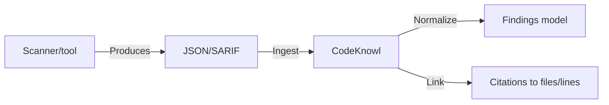
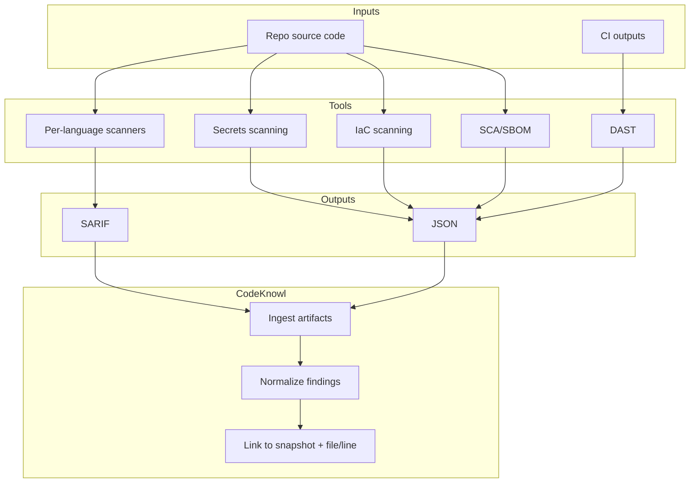

# Technology Research Seed: Commercially-permissible OSS components (initial list)

## Purpose
This document is the seed for CodeKnowl “technology research” and buy-vs-build decisions.

It focuses on OSS components that are commonly used in commercial contexts, **but highlights licensing constraints** that matter if CodeKnowl is:
- open source (MIT-licensed project), and/or
- a commercial product (including paid support/hosting)

This is not legal advice; it is a technical due diligence checklist.

## How to read this document
- “Commercially-permissible” here generally means:
  - the component’s license is commonly considered compatible with commercial use and redistribution (e.g., MIT, Apache-2.0), **or**
  - the component can be integrated as an optional external dependency that customers install and run themselves, **or**
  - the component is permissible for *internal use* but may be problematic to redistribute or bundle.
- When in doubt, CodeKnowl should prefer “integration” over “bundling”:
  - integrate via CLI/API, ingest results, and let customers supply binaries/rules
  - avoid redistributing rule packs/content with restrictive licenses

## OSS publication and redistribution policy (MIT-friendly)
CodeKnowl’s goal is to be safe and legal to publish as open source on GitHub under a permissive license (preferably MIT).

Accordingly, for every third-party component we consider, we must clearly classify:
- **Redistribute (bundle)**
  - Safe to include in the CodeKnowl repository and/or in CodeKnowl release artifacts.
  - Typical fit: MIT / Apache-2.0 / BSD-2-Clause / BSD-3-Clause licensed tools and libraries.
- **Integrate-only (user-supplied)**
  - CodeKnowl can support invoking it (CLI/API) and ingesting outputs, but **we do not bundle or redistribute** binaries, analyzers, or rule packs.
  - Typical triggers: source-available licenses, copyleft constraints we don’t want to inherit, “terms and conditions” licenses, or rule-content licenses that restrict redistribution.

Licensing permissiveness is an explicit, valid reason to push back on or revise an ITD choice, even if a tool is otherwise technically superior.

For the open-source CodeKnowl offering, the default posture is:
- Prefer **Redistribute (bundle)**
- Otherwise **Exclude** (rather than “integrate-only”), to avoid license violation risk.

For the MVP distribution of the open-source offering:
- CodeKnowl will be distributed as **source code only**.
- CodeKnowl will **not** publish official Docker images.
- CodeKnowl will **not** bundle scanner binaries.
- Scanner execution is expected to be either:
  - run in the adopter’s CI and ingested as SARIF/JSON artifacts, or
  - run locally by the adopter (CodeKnowl may support invoking tools if present).

Parking lot:
- Official Docker images (including any “tools” image) are deferred until adopter demand justifies the ongoing maintenance burden.
- Internal deployments may still use organization-managed container images (e.g., via a private registry), but that is separate from the open-source distribution posture.

### Policy summary (table)

| Classification | What it means for CodeKnowl OSS |
| --- | --- |
| Redistribute (bundle) | Safe to include in repository and/or release artifacts |
| Integrate-only (user-supplied) | Supported by invocation/ingestion, but CodeKnowl does not bundle binaries/rules |
| Exclude | Not supported in OSS offering due to licensing/terms risk |

## 1) SonarQube Community Build (SAST / code quality) — licensing caveat
### What it is
SonarQube Community Build is an on-prem automated code review and static analysis tool.

**Primary source:** https://docs.sonarsource.com/sonarqube-community-build

### Licensing caveat
SonarSource’s license page states:
- SonarQube Community Build binaries remain LGPLv3
- **Bundled analyzers** are subject to a new “Sonar Source-Available License Version 1.0 (SSALv1)” starting 29 Nov 2024
- Source code “without the analyzers” remains LGPLv3

**Primary source:** https://www.sonarsource.com/license/

### CodeKnowl integration posture
- Distribution posture: **Exclude (not redistributable-safe)**
- License risk note: **Bundled analyzers** licensing can impact redistribution/packaging.
- Product note: SonarQube-like value (findings + triage + trends) should be delivered by CodeKnowl using redistributable scanners and a CodeKnowl-owned findings model.

## 2) Semgrep Community Edition (SAST engine) — rules licensing caveat
### What it is
Semgrep Community Edition (CE) is positioned as a deterministic rules engine.

**Primary source:** https://semgrep.dev/products/community-edition/

### Output formats
Semgrep CE claims it can output findings in formats such as SARIF or JSON.

**Primary source:** https://semgrep.dev/products/community-edition/

### Licensing caveat (tool vs rules)
Semgrep’s licensing page distinguishes between:
- Product licensing
- The Semgrep Registry rules and rulesets

It states that Semgrep-maintained rules in the semgrep-rules repo are licensed under “Semgrep Rules License v1.0” and are available only for internal business use; vendors cannot use Semgrep-maintained rules in competing products or SaaS.

**Primary source:** https://semgrep.dev/docs/licensing

### CodeKnowl integration posture
- Distribution posture: **Exclude (not redistributable-safe)**
- License risk note: Semgrep-maintained rules are explicitly restricted for competing products/SaaS per Semgrep Rules License v1.0.
- Product note: prioritize redistributable scanners and CodeKnowl-owned rules/content where needed.

## 3) OWASP ZAP (DAST) — OSS baseline
### What it is
OWASP ZAP describes itself as a widely used, free and open-source web app scanner.

**Primary source:** https://www.zaproxy.org/

### What it covers
ZAP is focused on security testing/assessment workflows for web applications.

**Primary source:** https://www.zaproxy.org/getting-started/

### CodeKnowl integration posture
- Distribution posture: **Redistribute (bundle)**
- Treat ZAP as the baseline DAST engine for web services.
- Ingest results into CodeKnowl’s knowledge base and graph as:
  - findings
  - affected endpoints
  - proof/context artifacts (where possible)

## 4) Summary: how these fit CodeKnowl
- SonarQube Community Build:
  - Core SAST/quality pipeline signal
  - Licensing complexity around bundled analyzers
- Semgrep CE:
  - Flexible, fast SAST engine with machine-readable output
  - Licensing complexity around Semgrep-maintained rules
- OWASP ZAP:
  - Practical DAST baseline

| Tool | Category | Posture |
| --- | --- | --- |
| SonarQube Community Build | SAST / quality | Exclude |
| Semgrep CE (engine + rules caveat) | SAST | Exclude |
| OWASP ZAP | DAST | Redistribute (bundle) |

## 5) Additional OSS components to consider (commercially common)

### 5.1 Trivy (SCA / vuln scanning / SBOM / misconfig / secrets)
#### What it is
Trivy is a scanner that can be used to detect vulnerabilities and other issues across artifacts.

**Primary source (license):** https://github.com/aquasecurity/trivy/blob/main/LICENSE

#### CodeKnowl integration posture
- Distribution posture: **Redistribute (bundle)**
- Treat as a “broad-spectrum scanner” that can provide:
  - dependency/package vulnerability signal
  - container and IaC-related findings (where applicable)
  - SBOM generation (depending on workflow)
- Integrate by:
  - running Trivy in CI or in an indexing pipeline step
  - ingesting JSON/SARIF outputs as findings + evidence artifacts

### 5.2 Grype (SCA / vuln scanning)
#### What it is
Grype is a vulnerability scanner for container images and filesystems.

**Primary source (license):** https://github.com/anchore/grype/blob/main/LICENSE

#### CodeKnowl integration posture
- Distribution posture: **Redistribute (bundle)**
- Use as an additional/alternate vuln scanner (depending on customer preference).
- Ingest results into CodeKnowl as:
  - vulnerabilities mapped to packages
  - package-to-repo ownership signals (where determinable)

### 5.3 Syft (SBOM generation)
#### What it is
Syft is a CLI tool and library for generating Software Bills of Materials (SBOMs) from container images and filesystems.

**Primary source (license):** https://github.com/anchore/syft/blob/main/LICENSE

#### CodeKnowl integration posture
- Distribution posture: **Redistribute (bundle)**
- Use for SBOM generation as an artifact attached to a repo snapshot / commit.
- Ingest SBOM outputs into the knowledge base as:
  - components, versions, and licenses
  - provenance metadata (how/when generated)

### 5.4 Gitleaks (secret scanning)
#### What it is
Gitleaks is a tool for detecting secrets in Git repositories.

**Primary source (license):** https://github.com/gitleaks/gitleaks/blob/master/LICENSE

#### CodeKnowl integration posture
- Distribution posture: **Redistribute (bundle)**
- Treat as a baseline secrets scanner.
- Ingest results as:
  - findings with file + line range
  - remediation guidance links and standardized metadata

### 5.5 Checkov (IaC scanning)
#### What it is
Checkov is an infrastructure-as-code scanner.

**Primary source (license):** https://github.com/bridgecrewio/checkov/blob/main/LICENSE

#### CodeKnowl integration posture
- Distribution posture: **Redistribute (bundle)**
- Treat as a baseline IaC misconfiguration scanner.
- Ingest results as:
  - findings linked to IaC files/resources
  - standardized risk categories and severities

### 5.6 CodeQL CLI (SAST) — licensing caveat
#### What it is
CodeQL is GitHub’s semantic code analysis engine and query libraries.

**Primary source (license/terms):**
- https://github.com/github/codeql-cli-binaries/blob/main/LICENSE.md
- https://codeql.github.com/

#### Licensing caveat
CodeQL’s terms are not a standard permissive OSS license; usage constraints apply (including constraints around analyzing non-open-source code without a commercial license).

#### CodeKnowl integration posture
- Distribution posture: **Exclude (not redistributable-safe)**
- License risk note: non-standard terms + constraints make bundling/redistribution unsuitable for an MIT-distributed product by default.
- Product note: achieve most practical SAST/quality coverage via redistributable per-language scanners + SCA + secrets + IaC scanning.

## 5.7 MVP language scanner shortlist (redistributable-only)

This shortlist targets “80–90% of the practical effect” of SonarQube/Semgrep/CodeQL using redistributable components and a CodeKnowl-owned findings model.

### Java
- PMD (code quality rules)
  - Distribution posture: **Redistribute (bundle)**
  - Primary source (license): https://github.com/pmd/pmd/blob/main/LICENSE

### Python
- Ruff (lint/quality)
  - Distribution posture: **Redistribute (bundle)**
  - Primary source (license): https://github.com/astral-sh/ruff/blob/main/LICENSE
- Bandit (security checks)
  - Distribution posture: **Redistribute (bundle)**
  - Primary source (license): https://github.com/PyCQA/bandit/blob/main/LICENSE

### Go
- Gosec (security checks)
  - Distribution posture: **Redistribute (bundle)**
  - Primary source (license): https://github.com/securego/gosec/blob/master/LICENSE.txt

### JavaScript
- ESLint (lint/quality)
  - Distribution posture: **Redistribute (bundle)**
  - Primary source (license): https://github.com/eslint/eslint/blob/main/LICENSE

### TypeScript
- ESLint + typescript-eslint (lint/quality)
  - Distribution posture: **Redistribute (bundle)**
  - Primary source (license): https://github.com/typescript-eslint/typescript-eslint/blob/main/LICENSE

### Rust
- rustfmt (formatting)
  - Distribution posture: **Redistribute (bundle)**
  - Primary sources (license):
    - https://github.com/rust-lang/rustfmt/blob/master/LICENSE-MIT
    - https://github.com/rust-lang/rustfmt/blob/master/LICENSE-APACHE
- Cargo audit (dependency vulnerability checks via RustSec advisories)
  - Distribution posture: **Redistribute (bundle)**
  - Primary source (project/license posture): https://github.com/rustsec/rustsec
- RustSec advisory database
  - Distribution posture: **Redistribute (bundle)**
  - Primary source (license): https://github.com/rustsec/advisory-db/blob/main/LICENSE.txt
- cargo-deny (dependency license and policy checks)
  - Distribution posture: **Redistribute (bundle)**
  - Primary source (license): https://github.com/EmbarkStudios/cargo-deny/blob/main/LICENSE-MIT

Note: Rust linting via Clippy is highly valuable, but its distribution posture should be treated as “included if redistributable in our packaging approach” because it is commonly installed as part of the Rust toolchain.

## 6) Resolutions for formerly “next items”

This section exists to eliminate ambiguity: each potential area is either adopted (with an MIT-friendly redistribution posture) or explicitly excluded/parked.

### 6.1 Additional DAST options and non-web DAST needs
- Decision: **Exclude for MVP; keep OWASP ZAP as the baseline DAST engine.**
- Rationale: maximize simplicity and minimize license/compliance risk; DAST is not core to code understanding.
- Parking lot: non-web DAST and runtime scanning approaches (e.g., fuzzing, instrumentation, tracing) are **out of scope for now**.

### 6.2 Dependency/SCA alternatives and policy engines
- Decision: **Include SCA scanning via redistributable tools already listed (Trivy / Grype + Syft).**
- Decision: **Exclude “policy engines” for MVP.**
- Rationale: policy engines add configuration and ongoing policy maintenance burden; CodeKnowl can ingest scanner outputs first.

### 6.3 License policy scanners
- Decision: **Exclude for MVP.**
- Rationale: license policy enforcement is valuable, but it is not required for initial code understanding workflows and can become a product scope expansion.

### 6.4 Container runtime / Kubernetes posture scanners
- Decision: **Exclude for MVP.**
- Rationale: strong overlap with “running code scanning” and environment-specific posture management; not core to code understanding.

### 6.5 Canonical scanner integration contract (for CodeKnowl ingestion)
This is the required contract for any scanner CodeKnowl chooses to support.

#### Distribution requirements
- Default posture: **Redistribute (bundle)** only when the license is permissive and redistribution is straightforward.
- Otherwise: **Exclude** (preferred) rather than “integrate-only,” to avoid license violation risk.

#### Output requirements
- Scanner must emit one of:
  - SARIF
  - JSON with stable schema

#### Finding normalization requirements
- CodeKnowl must be able to normalize each finding into:
  - repository identifier
  - snapshot identifier (commit hash)
  - tool identifier + tool version
  - rule identifier
  - severity (normalized)
  - primary location (file path + line range)
  - message + optional description
  - optional secondary locations
  - optional evidence (snippets, URLs, fingerprints)

#### Baselines, suppressions, and triage
- Baseline: compute “new findings since baseline commit” for demo/test scenarios.
- Suppression model: represent suppressions as CodeKnowl-owned metadata (not tool-specific formats) keyed by (repo, rule id, location fingerprint).
- Status model: open / triaged / accepted risk / fixed.

## 7) Parking lot languages (not MVP)
- Rust (advanced security/quality beyond baseline linting + dependency checks)
- C# (.NET)
- C++ (Linux and embedded)

## References
- SonarQube Community Build docs: https://docs.sonarsource.com/sonarqube-community-build
- Sonar license notice: https://www.sonarsource.com/license/
- Semgrep CE: https://semgrep.dev/products/community-edition/
- Semgrep licensing (rules vs product): https://semgrep.dev/docs/licensing
- OWASP ZAP homepage: https://www.zaproxy.org/
- ZAP Getting Started: https://www.zaproxy.org/getting-started/
 - Trivy license: https://github.com/aquasecurity/trivy/blob/main/LICENSE
 - Grype license: https://github.com/anchore/grype/blob/main/LICENSE
 - Syft license: https://github.com/anchore/syft/blob/main/LICENSE
 - Gitleaks license: https://github.com/gitleaks/gitleaks/blob/master/LICENSE
 - Checkov license: https://github.com/bridgecrewio/checkov/blob/main/LICENSE
 - CodeQL CLI terms: https://github.com/github/codeql-cli-binaries/blob/main/LICENSE.md
 - CodeQL homepage (usage constraints): https://codeql.github.com/
